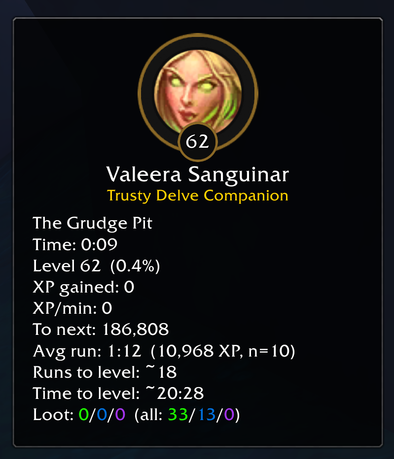
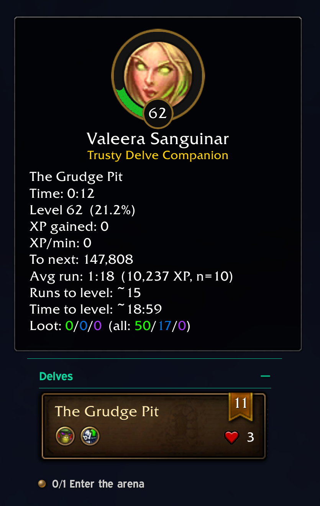
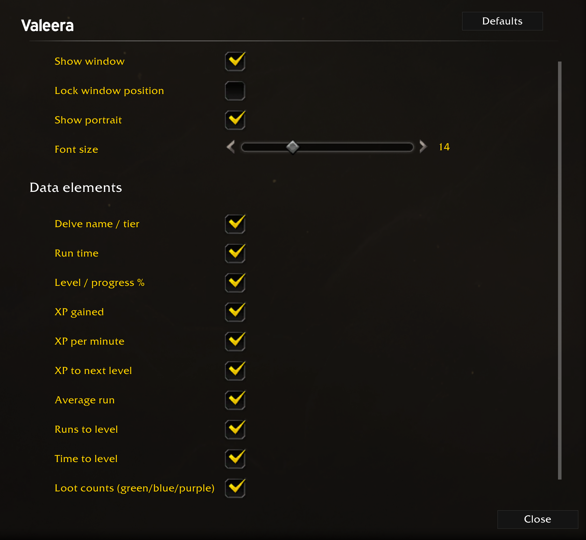
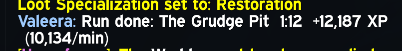

# Valeera

A lightweight World of Warcraft addon that tracks **Valeera Sanguinar's companion XP** while you run Delves — time per run, XP gained, XP/min, loot drops, and projections for how many runs / how long until her next level.

The window **only appears while you are inside a Delve** and hides itself everywhere else.



In a live run — the ring fills from the bottom clockwise as Valeera gains XP:



## Features

- **Portrait ring** — Valeera's portrait with a circular XP progress ring (fills from the bottom, clockwise) and a level badge, styled after the in-game companion panel.
- **Live run stats** — current Delve name + tier, elapsed time, companion level & % into level, XP gained this run, XP per minute, XP to next level.
- **Projections** — average run time and XP (last 10 XP-yielding runs), estimated runs to level, estimated time to level.
- **Loot tracking** — counts of uncommon / rare / epic items you loot per run and all-time.
- **Persistent history** — every completed run is saved to `ValeeraDB` (SavedVariables) so stats survive logout.
- **Last-run summary** shown when no run is active.
- **Configurable** — options panel under *Options → AddOns → Valeera*: show/hide window, lock position, show/hide portrait, font size, and a checkbox for every data line.



## Installation

### Manual

1. Download the latest release ZIP (or clone this repo).
2. Extract so you end up with this folder structure:

   ```
   World of Warcraft\_retail_\Interface\AddOns\Valeera\
       Valeera.toc
       Valeera.lua
   ```

   The folder **must** be named `Valeera` (matching `Valeera.toc`).
3. Launch WoW (or `/reload` if already logged in).
4. On the character select screen click **AddOns** and make sure *Valeera* is enabled. If it shows as *out of date*, tick **Load out of date AddOns**.

Default WoW paths:

| OS | Path |
|---|---|
| Windows | `C:\Program Files (x86)\World of Warcraft\_retail_\Interface\AddOns\` |
| macOS | `/Applications/World of Warcraft/_retail_/Interface/AddOns/` |

### From a clone (Windows, PowerShell)

```powershell
git clone https://github.com/johnrogers101a/valeera.git
$dst = "C:\Program Files (x86)\World of Warcraft\_retail_\Interface\AddOns\Valeera"
New-Item -ItemType Directory -Force $dst | Out-Null
Copy-Item .\valeera\Valeera.toc, .\valeera\Valeera.lua $dst -Force
```

## Usage

Just enter a Delve — the window appears automatically and a run starts. Leaving the Delve (or completing the scenario) ends the run, prints a summary to chat, and saves it to history.



Drag the window to move it (unless *Lock window position* is on).

### Slash commands

| Command | Effect |
|---|---|
| `/valeera` | Toggle the *Show window* option |
| `/valeera options` | Open the options panel |
| `/valeera reset` | Discard the current run and restart timing |
| `/valeera history` | Print the last 10 runs to chat |
| `/valeera clearhistory` | Wipe saved run history / stats |
| `/valeera faction <id>` | Pin the companion reputation faction ID (only if auto-detect fails) |

## How it works

- **Delve detection** — `C_PartyInfo.IsDelveInProgress()`, falling back to scenario instance type + Delve difficulty ID 208.
- **Companion XP** — read from Valeera's friendship reputation (`C_GossipInfo.GetFriendshipReputation`); the faction ID is auto-resolved by name.
- **Tier** — scraped from the Delve difficulty picker dropdown when you select a tier (approach borrowed from [this r/wowaddons thread](https://www.reddit.com/r/wowaddons/comments/1s0zilk/valeera_xp_gain_tracking)).
- **Loot** — `CHAT_MSG_LOOT` events for your own character, bucketed by item quality.

## License

MIT
